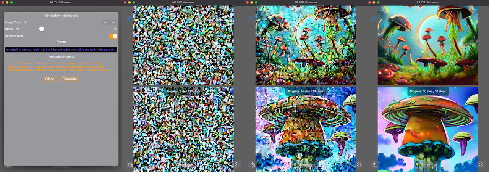
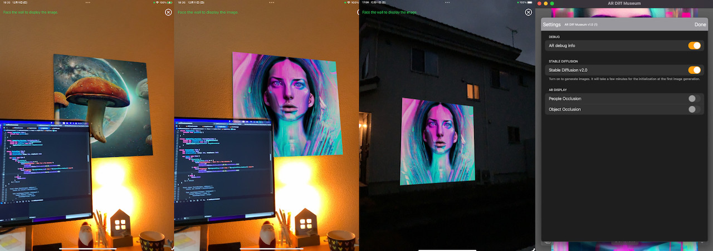
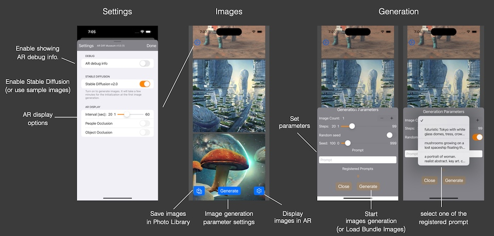
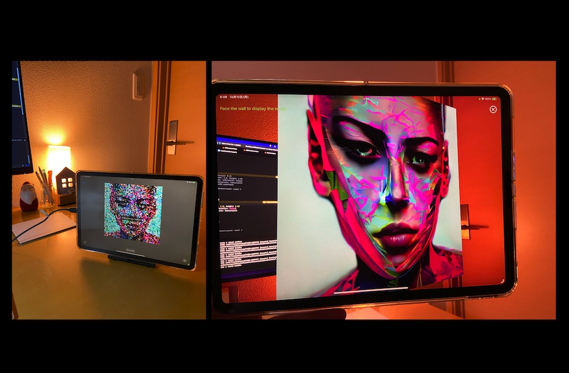

# iOS app - AR Diffusion Museum

An iOS app that generates images using Stable Diffusion and displays them in AR.

You can generate images specifying any prompt (text) and display them on the wall in AR.

- macOS 13.1 or newer, Xcode 14.2 or newer
- iPhone Pro 12+ / iOS 16.2+, iPad Pro with M1/M2 / iPadOS 16.2+

You can run the app on above mobile devices.
And you can run the app on Mac, building as a Designed for iPad app.

This Xcode project uses the `Apple/ml-stable-diffusion` Swift Package.

- Apple/ml-stable-diffusion Swift Package/Library
- SwiftUI, ARKit, RealityKit

This project does not contain the CoreML models of Stable Diffusion v2 (SD2).
You need to make them converting the PyTorch SD2 models using Apple converter tools.
You can find the instructions of converting models in Apple's repo on GitHub.

- Apple/ml-stable-diffusion repo: https://github.com/apple/ml-stable-diffusion

There is a Readme in another GitHub Repository that explains how to add Stable Diffusion CoreML models
to your Xcode project. Please refer to it.

- Image Generator with Stable Diffusion v2: https://github.com/ynagatomo/ImgGenSD2

## Change Log
- [1.0.2 (3)] - 2022-12-18 `[Merged]`
    - merged the PR by Sergey Dikarev. It uses the configuration, `MLModelConfiguration.computeUnits = .cpuAndGPU`,
    when creating a StableDiffusionPipeline. This configuration is suitable for mobile devices.
    And it adds two entitlements, `Extended Virtual Addressing` and `Increased Memory Limit`.
    They are suitable for an execution on iPhone.
    - if you encounter signing and capability errors for the entitlements,
    make sure that you are using the App ID which are registered the capabilities,
    "Extended Virtual Address Space" and "Increased Memory Limit",
    at Developer - Identifiers site.
    - not use the `.cpuAndGPU` config when running on macOS, otherwise it causes errors.

- [1.0.1 (2)] - 2022-12-16 `[Changed]`
    - use apple/ml-stable-diffusion Swift Package v0.1.0.
    - set `reduceMemory` option of `StableDiffusionPipeline(resource:)` to `true`.
    - iPhone requirements was changed to iPhone Pro 12+.

## Features

1. image generation using Stable Diffusion v2 on device
1. showing generating images step by step
1. saving generated images in Photo Library
1. displaying generated images on the wall in AR
1. automatic switching of displayed images at regular intervals
1. automatic enlargement according to viewing distance (Large projection on outdoor walls)
1. built-in sample images

## UI

This project provides a minimal UI. Feel free to extend it as you like.

## Consideration

### MPS internal error

- Currently, using CoreML Stable Diffusion Library and RealityKit API such as ModelEntity.load(name:)
together often causes MPS internal errors.
- As a workaround, the 3D model of the picture frame is replaced with a simple one now.

In action on iPad: image generation => AR display

## Related apps

There are related app's repo on GitHub.

- Img Gen SD2: https://github.com/ynagatomo/ImgGenSD2
- AR Wall Picture: https://github.com/ynagatomo/ARWallPicture

## References

- Apple Swift Package / ml-stable-diffusion: https://github.com/apple/ml-stable-diffusion
- Stable Diffusion with Core ML on Apple Silicon, Apple Dec 2022: https://machinelearning.apple.com/research/stable-diffusion-coreml-apple-silicon
- Deploying Transformers on the Apple Neural Engine, Apple June 2022: https://machinelearning.apple.com/research/neural-engine-transformers
- Hugging Face Hub - stabilityai/stable-diffusion-2: https://huggingface.co/stabilityai/stable-diffusion-2

